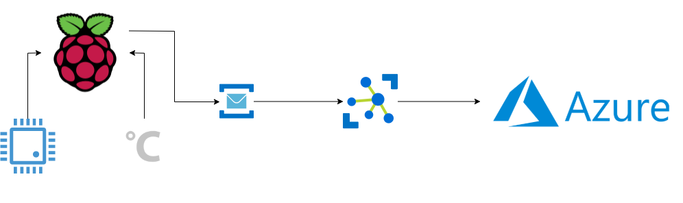

# raspberry-pi-dotnet-core-azure-iot




This is a quick and simple demonstration of using a Raspberry Pi, C#/.NET Core, the new official .NET Core IoT library, and Azure IoT Hub.

Although this is a simple console application (will be refactored to be a new .NET Core 3 Worker Service) it demonstrates a number of best practices and maintainable code.

For example it's using dependency injection, the new IOptions configuration pattern, and logging.

```csharp
private static ServiceProvider BuildCompositionRoot(IServiceCollection servicesCollection)
{
    var configuration = new ConfigurationBuilder()
        .AddJsonFile("appsettings.json", optional: false, reloadOnChange: true)
        .Build();
        
    var serviceProvider = new ServiceCollection()
        .AddOptions()
        .AddLogging(loggingBuilder => loggingBuilder.AddConsole())
        .Configure<AzureIoTHubConfiguration>(configuration.GetSection("AzureIoTHub"))
        .Configure<CpuTemperatureMonitorConfiguration>(configuration.GetSection("CpuTemperatureMonitor"))
        .AddTransient<IConfigurationLogger, ConfigurationLogger>()
        .AddTransient<ITemperatureReader, RaspberryPiCpuTemperatureReader>()
        .AddTransient<ICpuTemperatureMonitor, CpuTemperatureMonitor>()
        .AddTransient<App>()
        .BuildServiceProvider()
        
    return serviceProvider;
}
```
